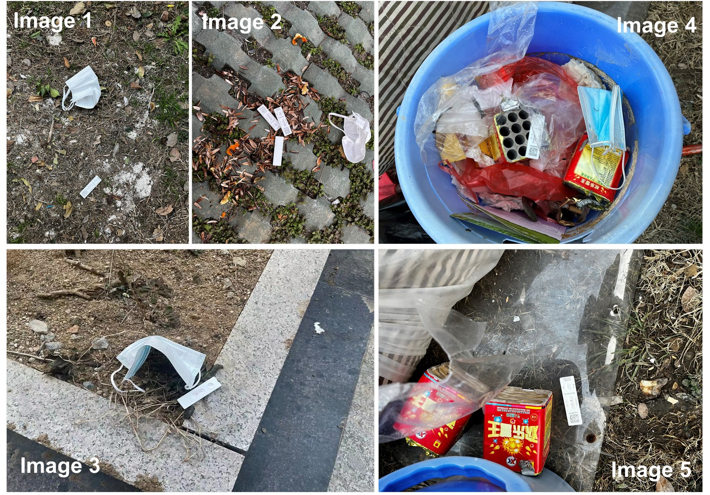

# Research Extension of Waste Detection

### Overview

This repositorty is built to demonstrate the extended work for waste detection with few data, whose original paper is submitted to the journal named "**Engineering Applications of Aritifical Intelligence**", with the abstract as follows:

> Automatic waste detection in natural environments exhibits a great potential to improve the efficiency and reduce the labor cost of waste management. Recent deep learning-based waste detectors rely heavily on substantial annotated samples for training, but annotating sufficient samples for various categories of waste is labor-intensive and time-consuming. To address this issue, this paper simulates the visual system of human beings and develops a few-shot waste detection framework. To enable the proposed framework more suitable for waste detection, a waste proposal module using a comprehensive feature fusion manner is designed to allow the features of support images to fully interact with those of query images, guiding the framework to generate more potential region proposals containing waste. Also, a waste classification module using soft attention mechanism and foreground mask is designed to alleviate the issue of spatial misalignment and achieve the fine-grained classification towards waste-related proposals. The proposed framework is a general detection framework which can flexibly detect various categories of waste with few labeled samples (i.e., less than 30 instances per category). Experimental results show that the proposed framework achieves a mean average precision of 31.16\% over 12 waste categories when only few samples (i.e., 30 instances per category) are provided, surpassing a state-of-the-art few-shot detector named AFDNet by 1.68\%. This data scale-insensitive nature allows humans to reduce the effort and time required for laborious waste image collection and annotation, significantly increasing the flexibility of automatic waste detection and boosting the efficiency of waste management.

### What we extended?

The increasing human resource consumption could bring about some new waste categories with scarce samples, such as **medical waste** (e.g., antigen detection kits) and **chemical waste**(e.g., containers of leachate toxic materials), and detecting them is of great significance for virus spread suppression and hazardous waste disposal.

Due to the rarity of those categories, it is difficult for us to develop a convincing data size to expand the experiments in this paper in a relatively short period of time. As such, we would continuously **collect the samples including those new waste categories** and **update the detection performance of the proposed framework** on them here. Also, we attempt to make the collected images of the new categories publicly available.

| Category                               | Sample number | K=1 | K=5 | K=10 | K=30 |
| -------------------------------------- | --- | --- | --- | ---- | ---- |
| Antigen detection kits                 | 230 images/ 364 instances (ongoing collecting)  | —   | —  | —    | —    |
| Disposable face mask                   | 340 images/ 522 instances (ongoing collecting)    | —   |—   | —    | —    |
| Containers of leachate toxic materials | —   | —   |—   | —    | —    |
| Radioactive materials packaging        | —   | —   |—   | —    | —    |

### How to get the dataset?

To encourage related research, we will provide the dataset according to your request. Please email your full name and affiliation to the contact person (**vvgod at seu dot edu dot cn**). We ask for your information only to make sure the dataset is used for non-commercial purposes. We will not give it to any third party or publish it publicly anywhere.

